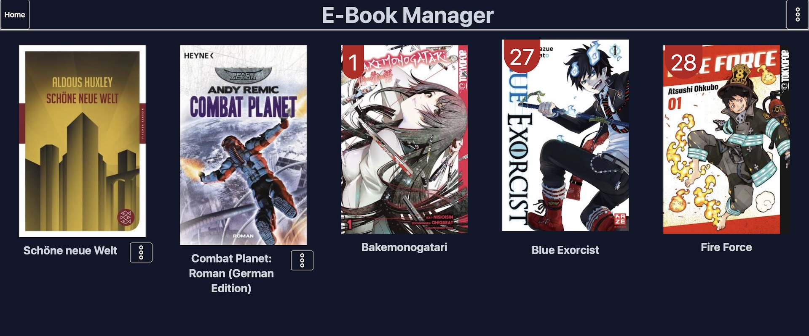
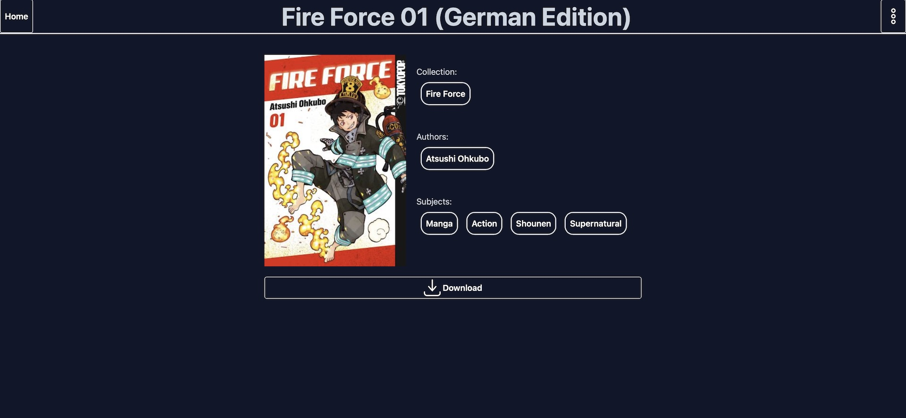

[](https://github.com/mathieu-keller/Ebook-Manager/actions/workflows/build_service.yml)
[](https://sonarcloud.io/summary/new_code?id=Ebook-Manager&branch=main)

# EBook Manager

A webapp that saves epub3 and offers it for download.
The service has a search function, user management, collections and has a light and dark mode. 

## Deployment

```
version: '3.8'
services:
  server:
    image: afrima/ebook-manager:latest
    restart: on-failure
    ports:
      - "8080:8080"
    environment:
      db-user: "ebook"
      db-password: "changeme"
      db-address: db
      db-schema: "ebook"
      login-salt: "changemeChangeme"
      admin-username: "admin"
      admin-password: "changeme"
    volumes:
      - '<path_where_to_save_epubs>:/work/upload'
    depends_on:
      - "db"
  db:
    image: postgres:16.2-alpine
    restart: on-failure
    environment:
      POSTGRES_PASSWORD: "changeme"
      POSTGRES_USER: "ebook"
      POSTGRES_DB: "ebook"
      PGDATA: /var/lib/postgresql/data/pgdata
    volumes:
      - '<path_where_to_save_db_data>:/var/lib/postgresql/data'
    ports:
      - "5432:5432"
```
## Pictures
### Home

### Collection

### Search

### Book Details
